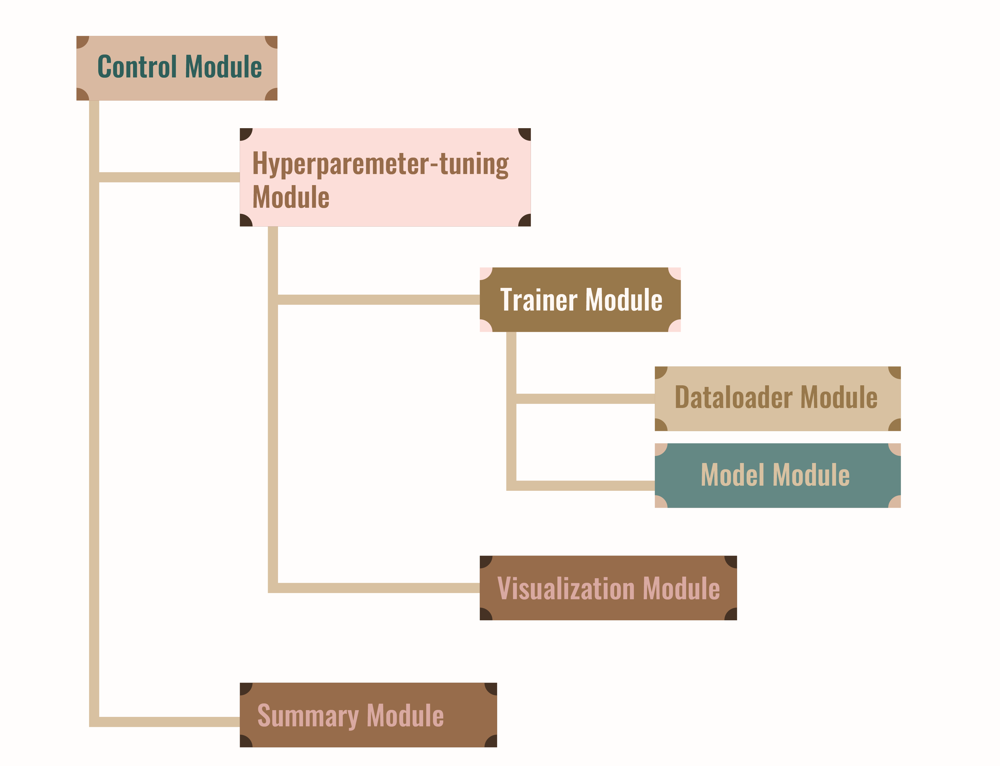

# CSE705 Image Segmentation using UNet

This project implements an image segmentation pipeline using the UNet architecture, tailored for the CSE705 course final project.

## Project Overview

<p align="center">
    
</p>

The project is divided into 7 modules, each responsible of addressing a specific aspect of the segmentation task:
1. **Fataloader Module**: Handles dataset loading, preprocessing, and augmentation.
2. **Model Module**: Implements the UNet architecture.
3. **Trainer Module**: Manages the training loop, including loss computation and optimization.
4. **Summary Module**: Implements metrics for assessing model performance on validation/test sets.
5. **Hyperparameter-tuning Module**: Provides functionality for applying the trained model to new images.
6. **Visualization Module**: Includes tools for visualizing model predictions and intermediate results.


## Installation

There are two recommended ways to set up this project:

### Option 1: Standard Python Virtual Environment

#### Installation Steps

## Requirements
- Python 3.10 or higher (3.12 is recommended)
- See `requirements.txt` for Python packages


1. **Clone the repository**
    ```bash
    git clone https://github.com/UGarCil/CSE705_UNet.git
    cd CSE705_UNet
    ```
2. **Create virtual environment**
    ```
    # Create virtual environment
    python -m venv venv_Unet

    # Activate it (Windows)
    venv_Unet\Scripts\activate.bat

    # OR (Mac/Linux)
    source venv_Unet/bin/activate
    ```
3. **Install dependencies**
    ```bash
    pip install -r requirements.txt
    ```