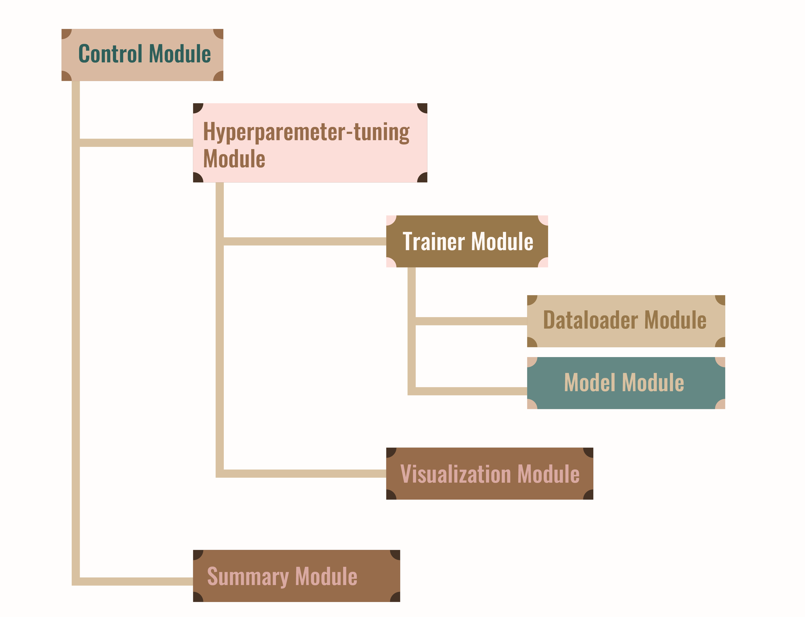

# CSE705 Image Segmentation using UNet

This project implements an image segmentation pipeline using the UNet architecture, tailored for the CSE705 course final project.

## Project Overview

<p align="center">
    
</p>

The project is divided into 7 modules, each responsible of addressing a specific aspect of the segmentation task:
1. **Fataloader Module**: Handles dataset loading, preprocessing, and augmentation.
2. **Model Module**: Implements the UNet architecture.
3. **Trainer Module**: Manages the training loop, including loss computation and optimization.
4. **Summary Module**: Implements metrics for assessing model performance on validation/test sets.
5. **Hyperparameter-tuning Module**: Provides functionality for applying the trained model to new images.
6. **Visualization Module**: Includes tools for visualizing model predictions and intermediate results.


## Installation

There are two recommended ways to set up this project:

### Option 1: Standard Python Virtual Environment

#### Prerequisites
- Python 3.6 or higher (Python 3.10 recommended)
- pip

#### Installation Steps

1. **Clone the repository**
    ```bash
    git clone https://github.com/UGarCil/EyewearTerrains
    cd EyewearTerrains
    ```

2. **Create a virtual environment**

    - **Windows:**
        ```bash
        python -m venv unet-env
        unet-env\Scripts\activate
        ```
    - **macOS/Linux:**
        ```bash
        python -m venv unet-env
        source unet-env/bin/activate
        ```

3. **Install the package and dependencies**
    ```bash
    pip install -e .
    ```

4. **Verify installation**
    ```bash
    python -c "import unet_segmentation; print('UNet segmentation installed successfully!')"
    ```

5. **Deactivate the environment when finished**
    ```bash
    deactivate
    ```

### Option 2: Anaconda Environment

#### Prerequisites
- Anaconda or Miniconda installed

#### Installation Steps

1. **Clone the repository**
    ```bash
    git clone https://github.com/UGarCil/EyewearTerrains
    cd EyewearTerrains
    ```

2. **Create a new conda environment with Python 3.10**
    ```bash
    conda create -n unet-env python=3.10
    conda activate unet-env
    ```

3. **Install the package and dependencies**
    ```bash
    pip install -e .
    ```
    Alternatively, use the provided `environment.yml` file:
    ```bash
    conda env create -f environment.yml
    conda activate unet-env
    ```

4. **Verify installation**
    ```bash
    python -c "import unet_segmentation; print('UNet segmentation installed successfully!')"
    ```

5. **Deactivate the environment when finished**
    ```bash
    conda deactivate
    ```

## Dependencies

This project requires the following Python packages:
- numpy
- matplotlib
- scikit-image
- scipy
